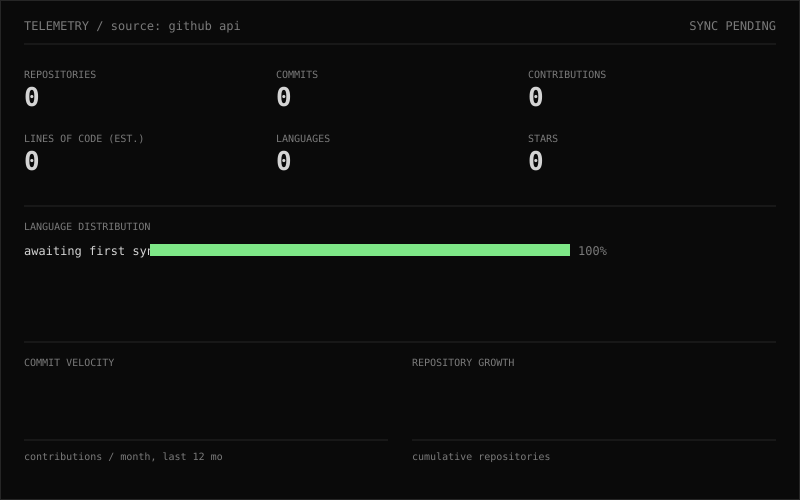

```
01 / ME
────────────────────────────────────────────────────────────
Irtaza Ahmad
Software Engineering Student · Full-Stack / Mobile Developer
FAST-NUCES Islamabad · 3rd Semester

Building mobile apps, backend systems, APIs and practical
software products.
```

```
02 / STACK
────────────────────────────────────────────────────────────
MOBILE      Flutter · Dart · Firebase
BACKEND     Python · FastAPI · PostgreSQL · SQLAlchemy
TOOLS       REST APIs · Git · Docker
ACADEMIC    C++ · DSA
```

```
03 / EXPERIENCE
────────────────────────────────────────────────────────────
MOBILE DEVELOPMENT                                     ~1 year
  Production Flutter applications
  Firebase · REST APIs · Authentication · Payments

CLIENT / PRODUCT DEVELOPMENT
  Booking · Real-time features · Admin systems · API integrations

AUTOMATION / BACKEND
  FastAPI · PostgreSQL · GoHighLevel · API automation 
```

```
04 / PROJECTS
────────────────────────────────────────────────────────────
01  MSM
    Flutter · Firebase · Stripe
    Booking / Authentication / Admin

02  RIDING PLATFORM
    GPS · Ride History · Group Rides
    Motorcycle analytics / community
```

```
05 / TELEMETRY
────────────────────────────────────────────────────────────
```


```
06 / BOOKS
────────────────────────────────────────────────────────────
CURRENTLY READING
> DDIA

RECENT
> software engineering a practitioner's approach

```

```
07 / CONTACT
────────────────────────────────────────────────────────────
GITHUB    →  github.com/irtaza-ahmadch
LINKEDIN  →  linkedin.com/in/irtaza-ahmad-a345a12a3/
EMAIL     →  irtazaahmadch18@gmail.com
```
